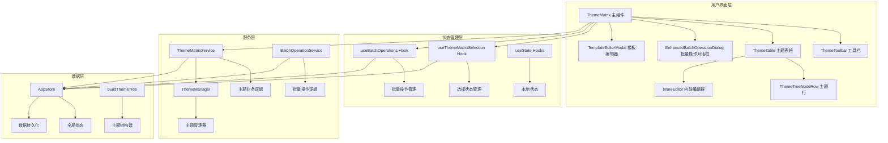
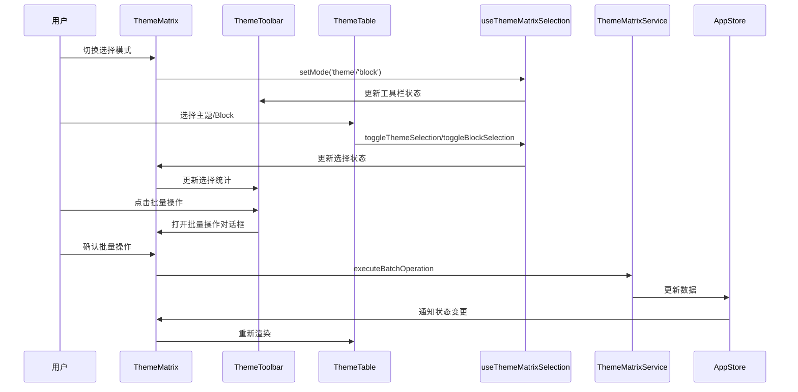
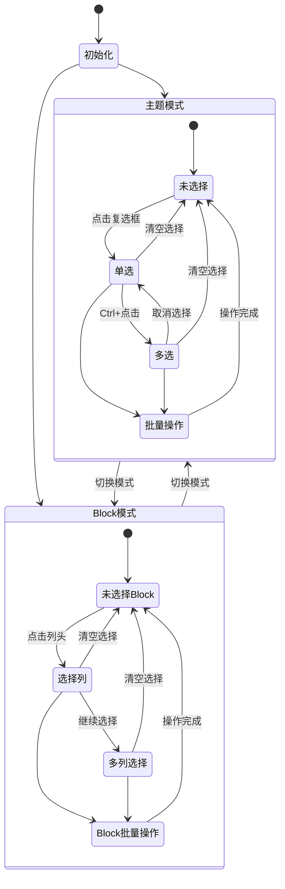
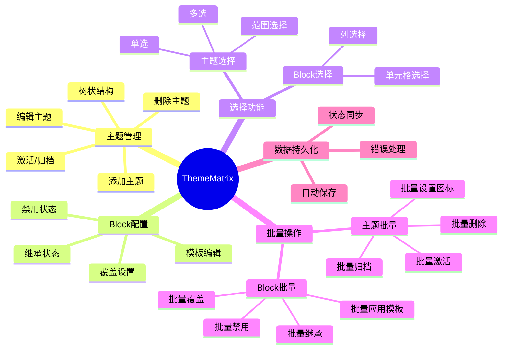
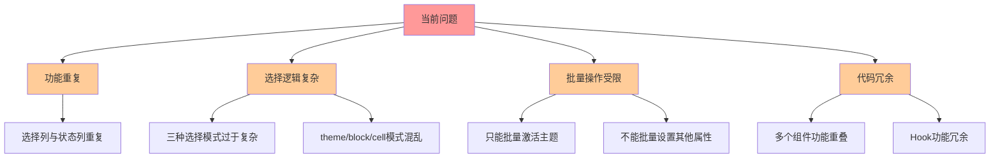
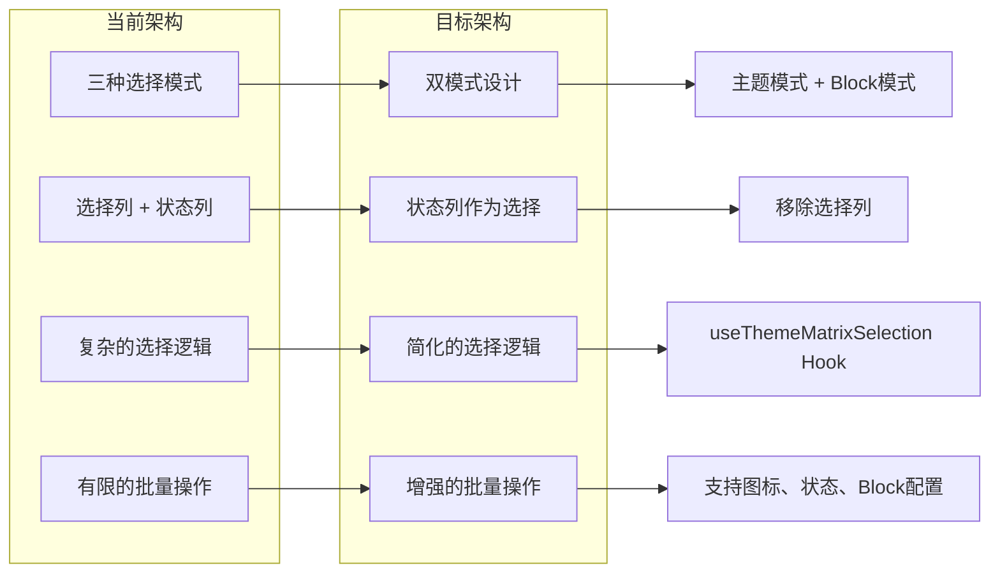
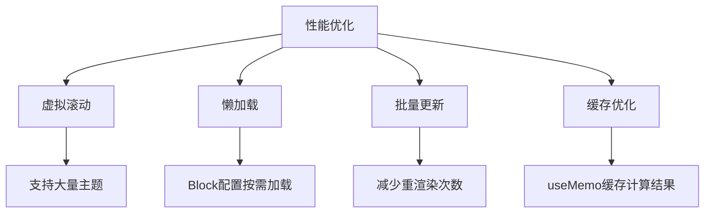

# ThemeMatrix 组件逻辑架构图

## 1. 整体架构图



## 2. 数据流图

```mermaid
flowchart LR
    subgraph "数据源"
        A[AppStore.settings.inputSettings]
        A1[blocks: BlockTemplate[]]
        A2[themes: ThemeDefinition[]]
        A3[overrides: ThemeOverride[]]
        A --> A1
        A --> A2
        A --> A3
    end
    
    subgraph "数据处理"
        B[ThemeMatrixService.getExtendedThemes]
        C[buildThemeTree]
        D[groupThemesByStatus]
        
        A2 --> B
        B --> C
        C --> D
    end
    
    subgraph "UI渲染"
        E[extendedThemes]
        F[themeTree]
        G[activeThemes / archivedThemes]
        H[overridesMap]
        
        B --> E
        C --> F
        D --> G
        A3 --> H
    end
    
    subgraph "用户交互"
        I[选择操作]
        J[批量操作]
        K[单元格编辑]
        L[主题管理]
    end
    
    E --> I
    F --> J
    G --> K
    H --> L
```

## 3. 组件交互图



## 4. 状态管理图



## 5. 核心功能模块图



## 6. 问题分析图



## 7. 重构方案图



## 8. 关键代码逻辑

### 8.1 选择状态管理
```typescript
// 当前实现
const {
    selection,           // 选择状态
    selectionStats,      // 选择统计
    mode,               // 选择模式 (theme/block/cell)
    toggleThemeSelection,
    toggleBlockSelection,
    selectAll,
    clearSelection
} = useThemeMatrixSelection(themeTree);
```

### 8.2 批量操作流程
```typescript
// 操作流程
User Action → Selection Hook → Batch Dialog → Service Layer → AppStore → Persistence
```

### 8.3 数据持久化
```typescript
// 持久化机制
AppStore._updateSettingsAndPersist = async (updater) => {
    // 1. 更新内存状态
    // 2. 保存到磁盘
    // 3. 通知订阅者
}
```

## 9. 性能优化点



## 10. 修改建议

基于分析，建议的修改方向：

1. **简化选择模式**：从三种模式简化为两种（主题模式 + Block模式）
2. **移除选择列**：使用状态列的复选框作为主题选择
3. **增强批量操作**：支持图标、状态、Block配置的批量设置
4. **代码重构**：清理冗余组件和Hook
5. **性能优化**：添加虚拟滚动和缓存机制

你想要修改哪个具体的方面？我可以帮你实现相应的改进。
