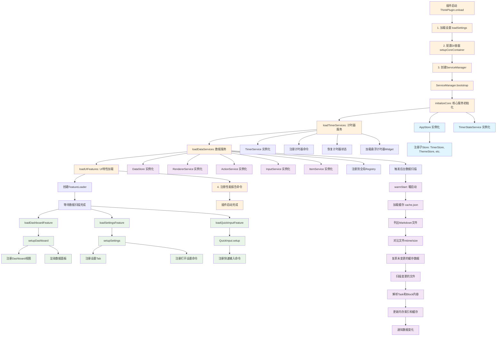
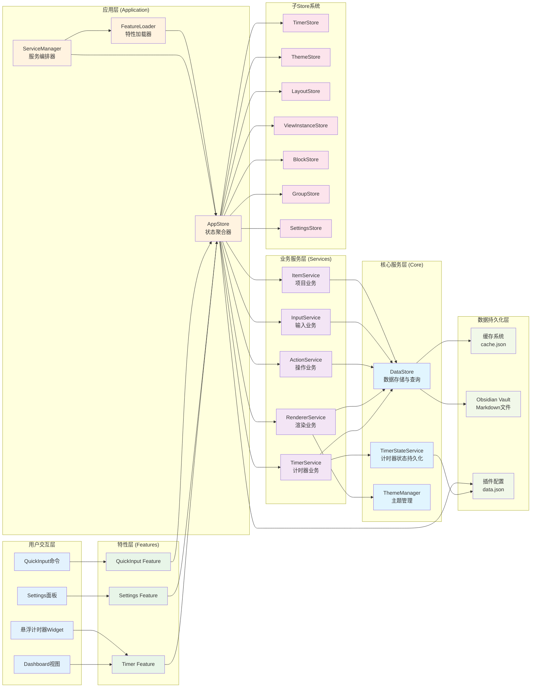
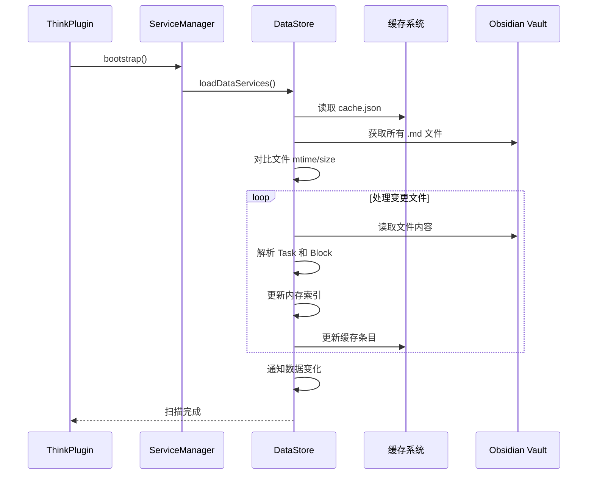
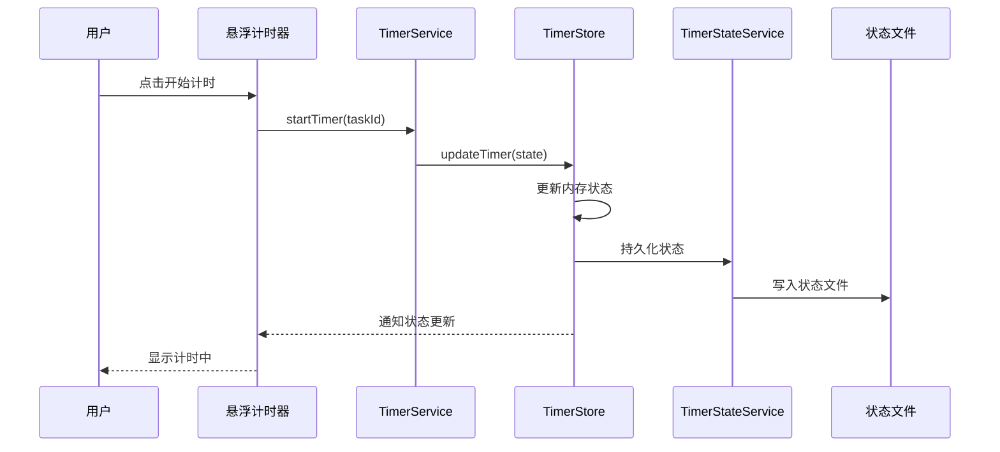
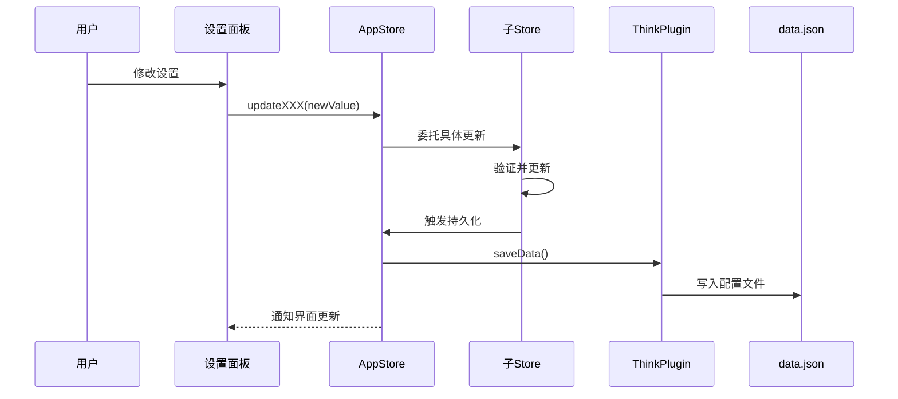

# Think Plugin 功能流程图

## 插件启动与模块加载流程

## 数据流架构图

## 核心业务流程

### 1. 数据扫描与索引流程

### 2. 计时器业务流程

### 3. 设置管理流程

## 模块职责表

| 模块类型 | 模块名 | 主要职责 | 主要文件 |
|---------|--------|---------|---------|
| **入口层** | ThinkPlugin | 插件生命周期管理 | `src/main.ts` |
| **应用层** | ServiceManager | 服务编排与生命周期 | `src/app/ServiceManager.ts` |
|  | FeatureLoader | UI特性加载 | `src/app/FeatureLoader.ts` |
|  | AppStore | 状态聚合与持久化 | `src/app/AppStore.ts` |
| **特性层** | Timer Feature | 计时器功能 | `src/features/timer/` |
|  | Settings Feature | 设置管理功能 | `src/features/settings/` |
|  | QuickInput Feature | 快速输入功能 | `src/features/quickinput/` |
| **服务层** | TimerService | 计时器业务逻辑 | `src/features/timer/TimerService.ts` |
|  | DataStore | 数据扫描与查询 | `src/core/services/DataStore.ts` |
|  | RendererService | 布局渲染 | `src/features/settings/RendererService.ts` |
| **存储层** | TimerStore | 计时器状态 | `src/features/timer/TimerStore.ts` |
|  | ThemeStore | 主题状态 | `src/features/settings/ThemeStore.ts` |
|  | 其他子Store | 各种业务状态 | `src/features/settings/*Store.ts` |

## 关键设计模式

1. **依赖注入 (DI)**: 使用 tsyringe 容器管理服务生命周期
2. **发布订阅**: Store 系统通过订阅机制通知 React 组件更新
3. **分层架构**: 严格的层次依赖，上层可调用下层，下层不依赖上层
4. **状态委托**: AppStore 作为聚合器，具体逻辑委托给子 Store
5. **缓存优化**: DataStore 使用文件 mtime/size 对比实现增量扫描
6. **特性模块化**: 每个功能特性独立封装，可插拔
